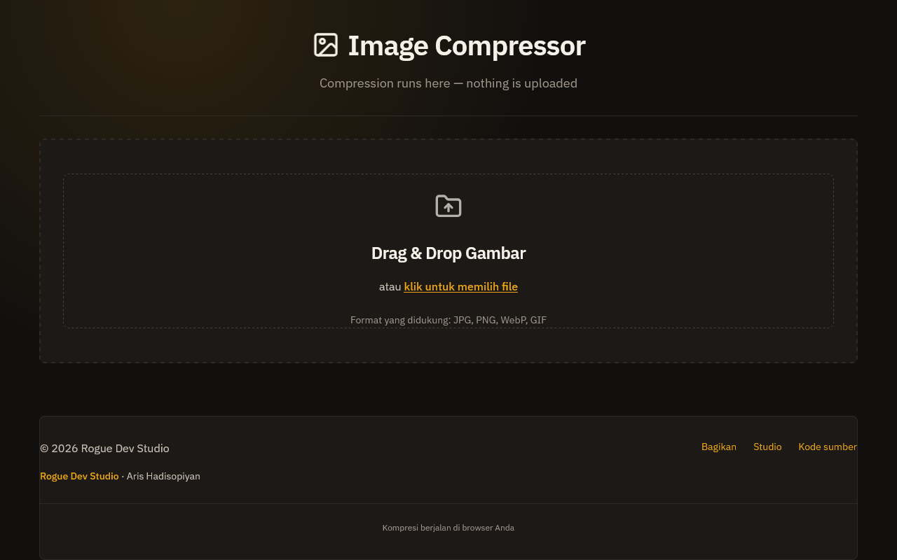

# Image Compressor

Shrink JPG, PNG, WebP, or GIF in the tab — nothing is uploaded.



**Live demo:** [https://rogue-dev-studio.github.io/image-compressor/](https://rogue-dev-studio.github.io/image-compressor/)

## Highlights
- Drag one or many images
- Tune quality and max size
- Download the result

## Run
Open `index.html` locally (Live Server on port **5500**), or use the live demo above.

```bash
git clone https://github.com/rogue-dev-studio/image-compressor.git
```

By [Aris Hadisopiyan](https://rogue-dev-studio.github.io/) / Rogue Dev Studio.

MIT
